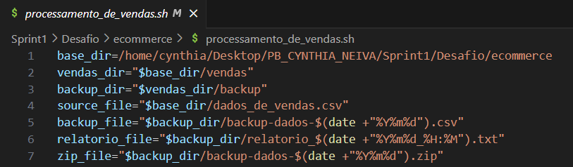
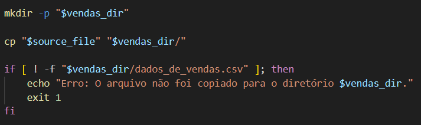
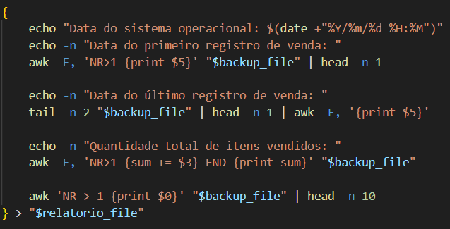
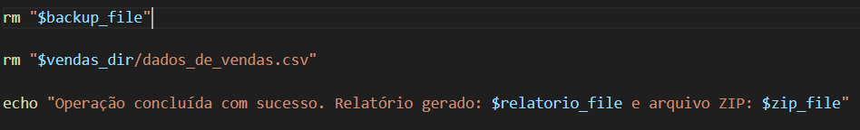
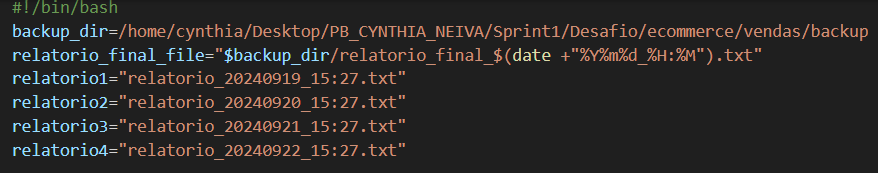
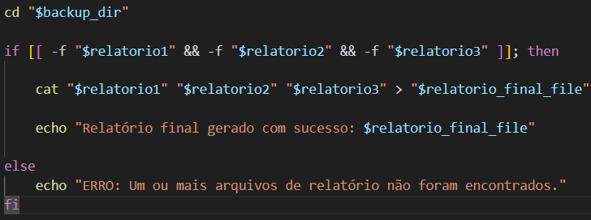

# Objetivos

Este script automatiza o processo de backup de um arquivo de vendas e gera um relatório com informações sobre as vendas. Ele realiza as seguintes ações:

* Cria os diretórios necessários.
* Copia o arquivo de vendas para o diretório de vendas e o diretório de backup.
* Gera um relatório detalhado.
* Compacta o backup e o relatório em um arquivo ZIP.
* Remove os arquivos temporários.
* Combinar quatro arquivos de relatório em um único relatório final.

# Definição de Variávis - Etapa 1

O script define os diretórios e arquivos que serão usados ao longo da execução:

* base_dir: Diretório base para o projeto.
* vendas_dir: Diretório onde os dados de vendas serão copiados.
* backup_dir: Diretório onde os backups dos dados serão armazenados.
* source_file: Arquivo CSV original de dados de vendas.
* backup_file: Nome do arquivo de backup gerado, com a data no nome.
* relatorio_file: Arquivo de relatório gerado a partir dos dados de vendas.
* zip_file: Arquivo ZIP que armazenará o backup e o relatório.

# Criação do Diretório de Vendas - Etapa 1 

O script cria o diretório vendas_dir, onde o arquivo de vendas original é copiado. O script verifica se o arquivo foi copiado corretamente e, caso contrário, exibe uma mensagem de erro e encerra.

# Criação do Diretório Backup - Etapa 1

O script cria o diretório de backup e em seguida copia o arquivo de vendas com um nome que inclui a data atual. Caso a cópia falhe, o script exibe uma mensagem de erro e encerra.

# Conteúdo do Relatório - Etapa 1

O script cria um relatório em formato txt contendo as seguintes informações:

* Data e hora atuais do sistema.
* Data do primeiro registro de venda.
* Data do último registro de venda.
* Quantidade total de itens vendidos.
* Os primeiros 10 registros do arquivo de backup.

#  Criação do Arquivo ZIP - Etapa 1

O script navega até o diretório de backup e cria um arquivo ZIP que contém o arquivo de backup e o relatório. Caso o arquivo ZIP não seja criado corretamente, o script exibe uma mensagem de erro e encerra.

# Conclusão do Script - Etapa 1

Após criar o arquivo ZIP, o script remove o arquivo de backup e o arquivo de vendas original para liberar espaço. Ao final, o script exibe uma mensagem confirmando que o relatório foi gerado e o arquivo ZIP foi criado com sucesso:

# Definição de Variávis - Etapa 2

* backup_dir: Define o diretório onde os relatórios estão armazenados.
* relatorio_final_file: Define o nome do relatório final que será gerado, incluindo a data e hora atuais.
* relatorio1, relatorio2, relatorio3, relatorio4: São os nomes dos arquivos de relatório que serão concatenados. Neste caso, o script tenta combinar os quatros relatórios.

# Criação do Relatório Final

O script navega até o diretório backup e cria um relatório final com o conteído dos 4 relatórios existentes. Caso a criação falhe, o script exibe uma mensagem de erro.

