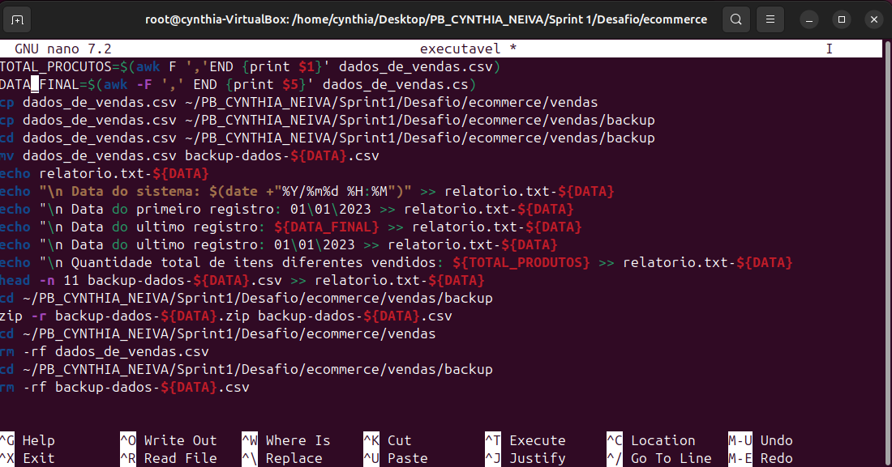
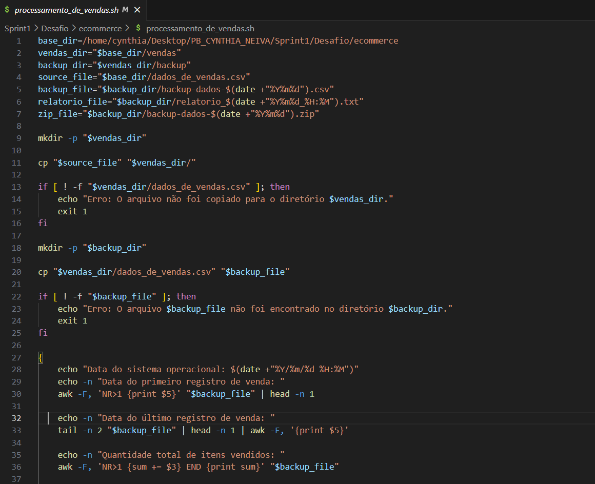
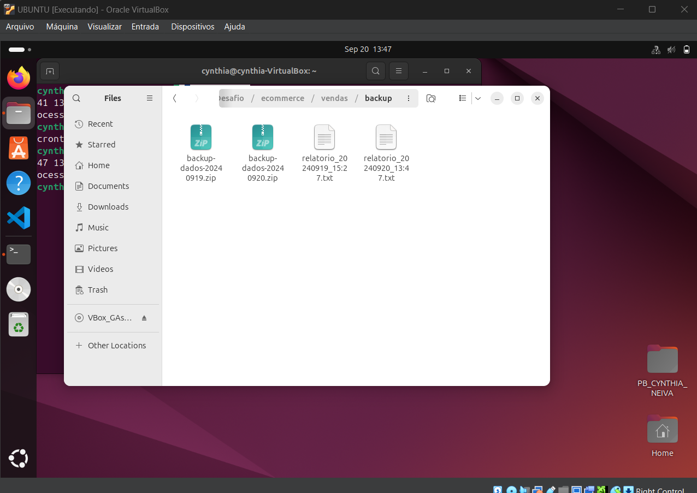
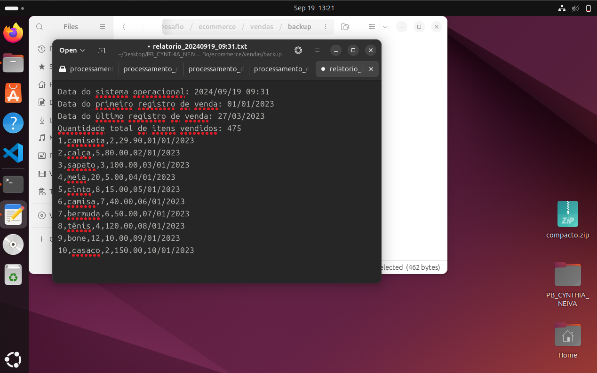
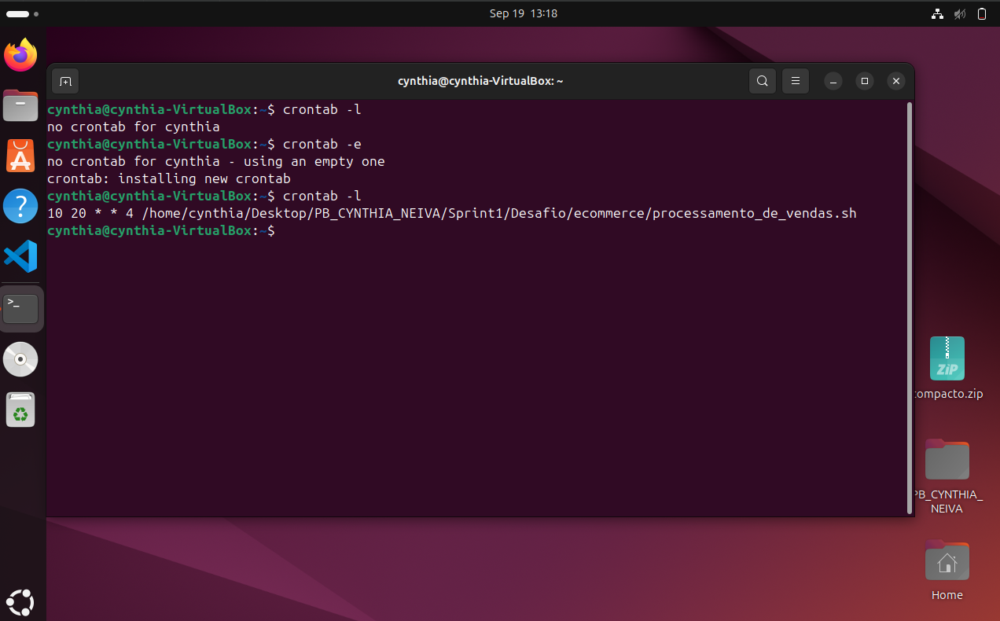
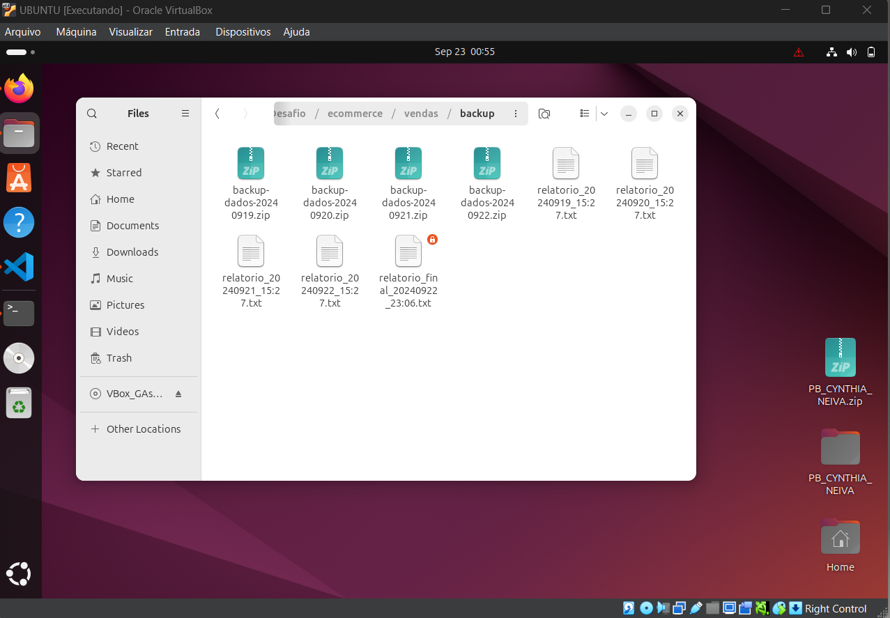
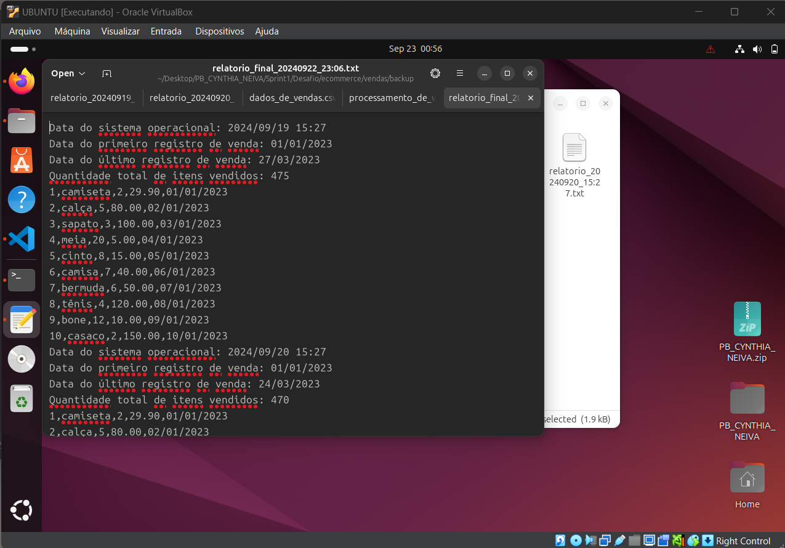

# Evidências

Na primeira tentativa de criação do código do arquivo processamentos_de_vendas.sh, observei que estava errando na estrutura do código e na sintaxe, porém estava com a ideia formada na mente, conforme podemos ver na imagem a seguir:

Partindo da primeira tentativa, estudei mais possibilidades da criação do código e comandos do linux, conforme a imagem a seguir:

Tive bons resultados logo após modificar completamente o meu código, o script estava navegando corretamente entre os diretórios e zipando conforme requisitado, como podemos observar a seguir:

Observei que no processo do script estava errando nos comandos para ler o arquivo csv, mas procurei mentorias e conseguir executar, como pode observar a seguir:

Após o script do processamento_de_vendas esta rodando normalmente e sem erros, comecei a fazer testes no crontab sem nenhuma dificuldade, conforme a seguir:

Em seguida com os teste do processamento_de_vendas e crontab funcinando perfeitamente, criei o arquivo consolidador_de_processamento_de_vendas.sh, não tive nenhuma dificuldade desta vez ja que pesquisei bastante de como para fazer o primeiro script.

# Certificados

* Certificado do Curso HTML5 BÁSICO (REFATORANDO)

* Certificado da Imersão Alura Front-end (Alura)

* Certificado da Imersão Alura Ánalises de Dados com IA (Alura)

* Certificado da do Curso Introdução ao Design de Interação (UX/UI) (Tic em Trilhas)

