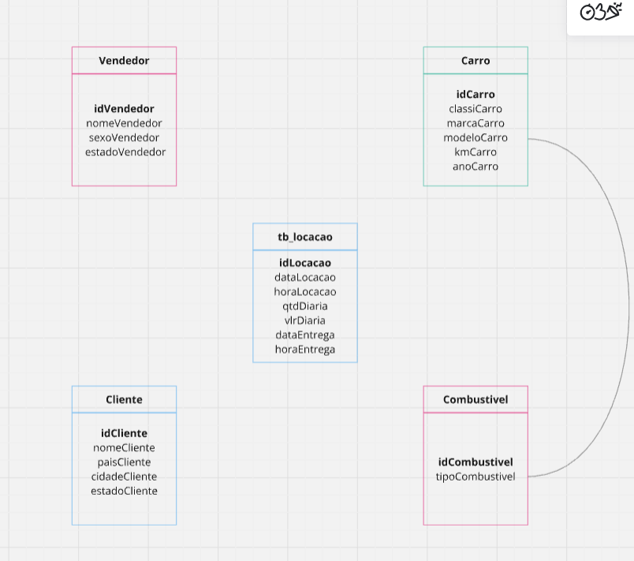
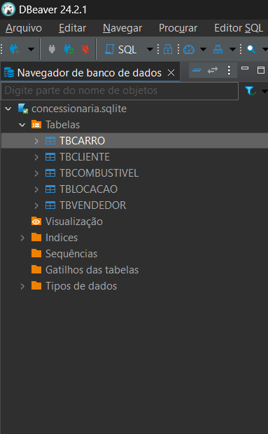
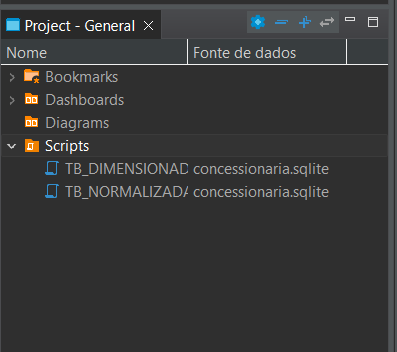

# Modelo Relacional
  
  Primeiro modelo relarional criado como base na plataforma Miro para dar andamento no desafio.

# Criando tabelas 
  
  Criações de tabelas partindo do modelo relacional criado.

# Criações de Scripts
  
  Criações de Script para a finalização do desafio.

