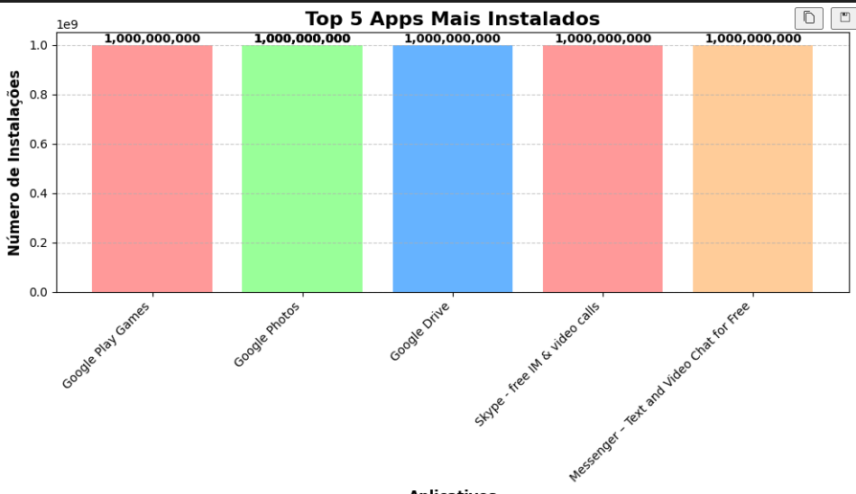
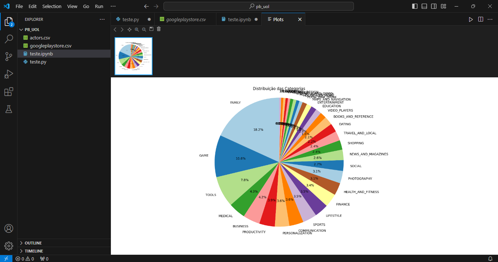
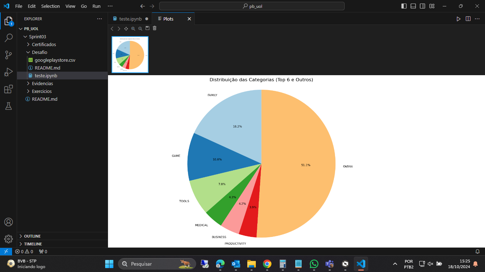
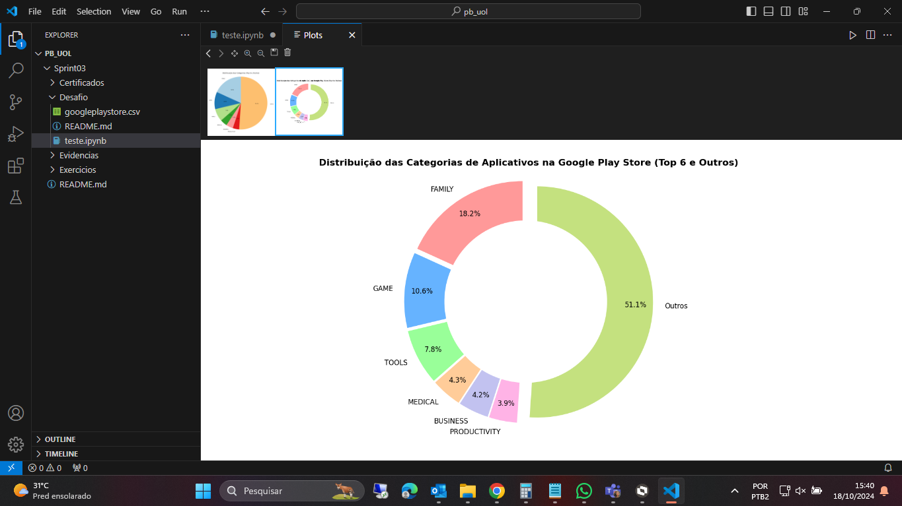
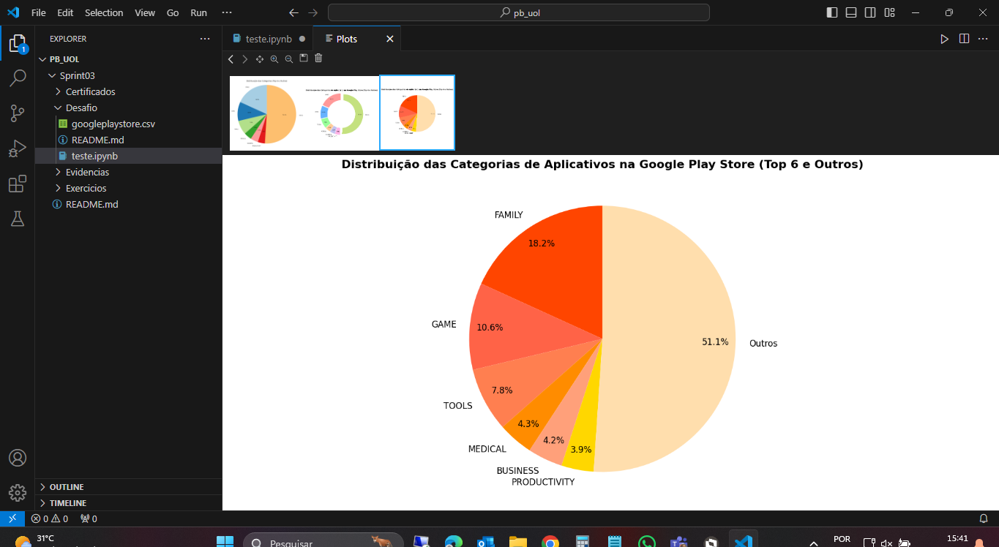
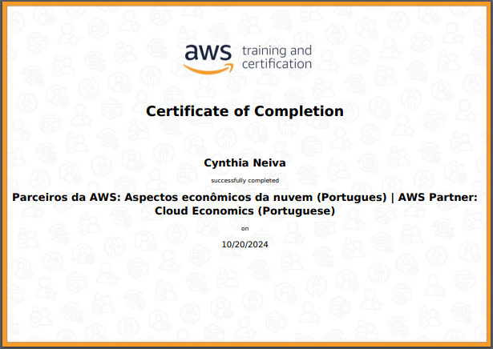

# Exercícios

1. [Exercicio_Python_I_1-2](Exercicios/Exercicio_Python_I_1-2)

2. [Exercicio_Python_I_2-2](Exercicios/Exercicio_Python_I_2-2)

3. [Exercicio_Python_II](Exercicios/Exercicio_Python_II)

# Evidências

* Primeiro teste do grafico de tabelas.
 
 
 

* Primeiro grafico criado do Pie Chart.
 
 
 

* Segundo grafico criado do Pie Chart.

* Terceiro grafico criado do Pie Chart.
 
 
 

* Quarto grafico criado do Pie Chart.
 
 
 

# Certificados

- Certificado da AWS disponibilizado na Sprint

