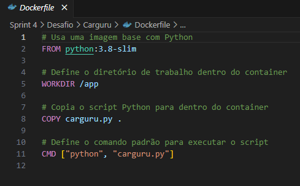
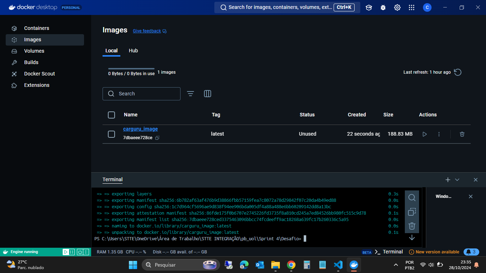
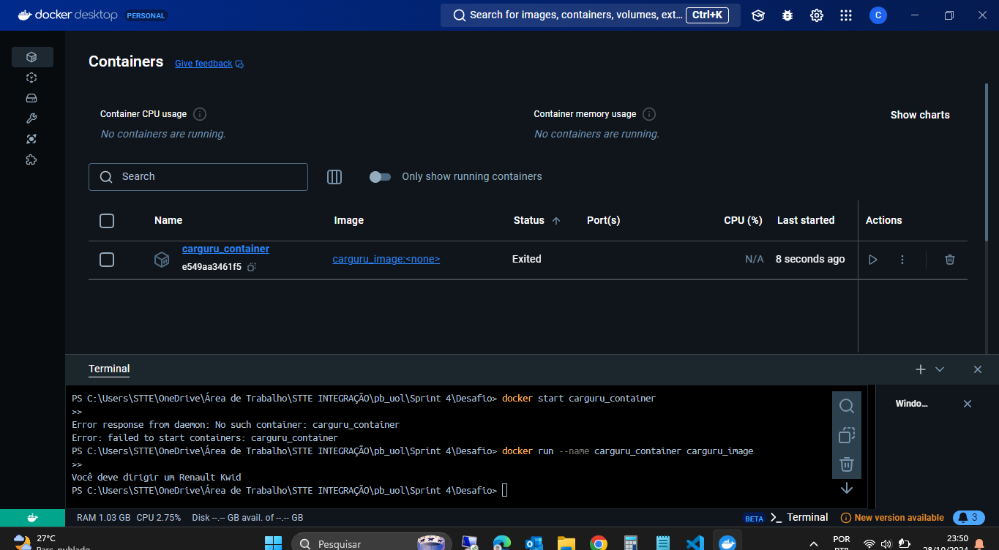

# Objetivo do Desafio

O objetivo desse desafio é praticar o uso de Docker com Python para trabalhar com containers. Esse desafio combina conceitos importantes para a criação e uso de containers, que facilitam o empacotamento, distribuição e execução de aplicações em ambientes isolados.

# Dockerfile Carguru - Etapa 01
 

 

* python:3.8-slim: Especifica uma versão leve do Python 3.8. A versão "slim" é otimizada para ter um tamanho menor, incluindo apenas os pacotes essenciais. Isso é útil para reduzir o tamanho final da imagem e melhorar a eficiência.
* /app: Esse é o diretório escolhido. Ao definir um diretório de trabalho, evita-se a necessidade de especificar caminhos completos toda vez que quiser acessar ou manipular arquivos.
* carguru.py: O primeiro parâmetro é o arquivo local a ser copiado.
* CMD ["python", "carguru.py"]: Quando o container é executado, ele rodará python carguru.py. Esse comando chama o interpretador Python para executar o script carguru.py.

# Criação da Imagem - Etapa 01
 

 

* Após a criação do Dockerfile, usei o comando docker build -t carguru_image . para a criação da imagem.

# Criação do Container - Etapa 01
 

 

* Logo após, com o comando docker run --name carguru_container carguru_image, criei o container partind da imagem criada.

# Reutilização de Containers - Etapa 01
 

 

* Respondendo o questionamento levantado no desafio. Sim, é possível reutilizar containers parados no Docker. Para reiniciar um container parado, apenas utilizando o comando: docker start carguru_container.

  
