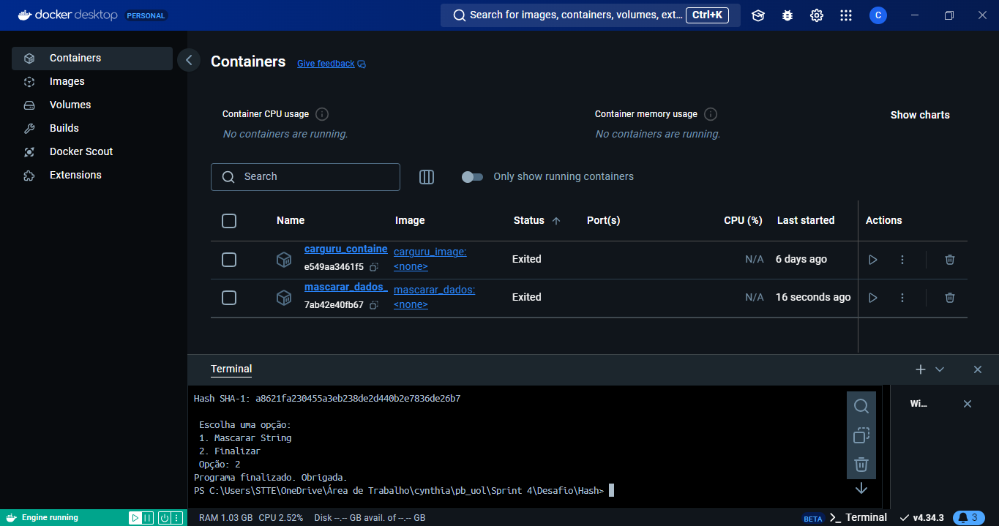

# Objetivo do Desafio

O objetivo desse desafio é praticar o uso de Docker com Python para trabalhar com containers. Esse desafio combina conceitos importantes para a criação e uso de containers, que facilitam o empacotamento, distribuição e execução de aplicações em ambientes isolados.

# Dockerfile Carguru - Etapa 01
 

 

* python:3.8-slim: Especifica uma versão leve do Python 3.8. A versão "slim" é otimizada para ter um tamanho menor, incluindo apenas os pacotes essenciais. Isso é útil para reduzir o tamanho final da imagem e melhorar a eficiência.
* /app: Esse é o diretório escolhido. Ao definir um diretório de trabalho, evita-se a necessidade de especificar caminhos completos toda vez que quiser acessar ou manipular arquivos.
* carguru.py: O primeiro parâmetro é o arquivo local a ser copiado.
* CMD ["python", "carguru.py"]: Quando o container é executado, ele rodará python carguru.py. Esse comando chama o interpretador Python para executar o script carguru.py.

# Criação da Imagem - Etapa 01
 

 

* Após a criação do Dockerfile, usei o comando docker build -t carguru_image ., para a criação da imagem.

# Criação do Container - Etapa 01
 

 

* Logo após, com o comando docker run --name carguru_container carguru_image, criei o container partindo da imagem criada.

# Reutilização de Containers - Etapa 02
 

 

* Respondendo o questionamento levantado no desafio. Sim, é possível reutilizar containers parados no Docker. Para reiniciar um container parado, apenas utilizando o comando: docker start carguru_container. A reutilização pode ser vantajosa em termos de velocidade e eficiência, pois o container não precisa ser recriado do zero.

# Script Hash - Etapa 03

 

Este programa permite ao usuário criar um hash SHA-1 para strings de entrada válidas, o que pode ser útil para mascaramento e verificação de integridade.
 

* option = input(...): Solicita que o usuário escolha uma opção entre 1 (mascarar uma string) e 2 (finalizar o programa).
* data = input(...): Pede ao usuário que insira a string para mascaramento.
* re.match(r'^[A-Za-zÀ-ÿ\s]+$', data): Usa uma expressão regular que verifica
* ^[A-Za-zÀ-ÿ\s]+$: A string deve começar e terminar com letras (de A a Z, acentuadas ou não), e pode conter espaços (\s). Qualquer outro caractere será considerado inválido.
* hashlib.sha1(data.encode()): Codifica a string data e passa para o algoritmo SHA-1.
* hex_dig = hash_object.hexdigest(): Converte o hash gerado em um formato hexadecimal legível, armazenado em hex_dig.

# Dockerfile Hash - Etapa 03

 

* python:3.8-slim: Especifica uma versão leve do Python 3.8. A versão "slim" é otimizada para ter um tamanho menor, incluindo apenas os pacotes essenciais. Isso é útil para reduzir o tamanho final da imagem e melhorar a eficiência.
* /app: Esse é o diretório escolhido. Ao definir um diretório de trabalho, evita-se a necessidade de especificar caminhos completos toda vez que quiser acessar ou manipular arquivos.
* hash.py: O primeiro parâmetro é o arquivo local a ser copiado.
* CMD ["python", "hash.py"]: Quando o container é executado, ele rodará python carguru.py. Esse comando chama o interpretador Python para executar o script carguru.py.

# Criação da Imagem - Etapa 03
 

 

* Logo após, com o comando docker build -t mascarar_dados ., para a criação da imagem.

# Criação do Container - Etapa 03
 

 

* Logo após, com o comando docker build -t mascarar_dados ., para a criação da imagem.

# Executar o Container com o Script Interativo - Etapa 03

 

* Com o comando docker run -it mascarar_dados, roda o container de forma interativa, permitindo que você forneça uma entrada ao script.
