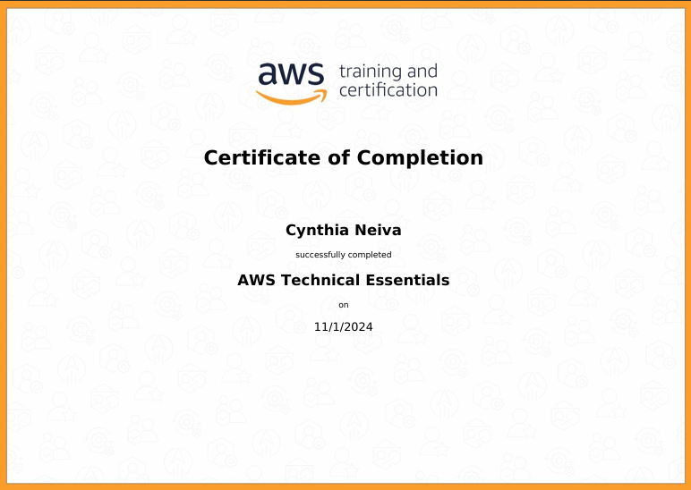
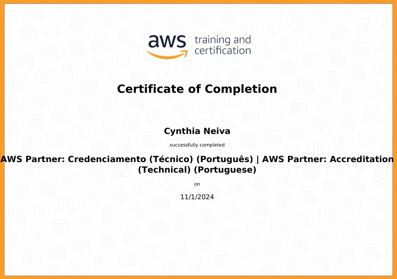

# Exercícios

1. [Exercicios Feitos na Sprint](Exercicios/)

# Evidências

Ao executar o código do exercício ... observei que ... conforme podemos ver na imagem a seguir:

# Certificados

- Certificado da AWS disponibilizado na Sprint

- Certificado da AWS disponibilizado na Sprint

