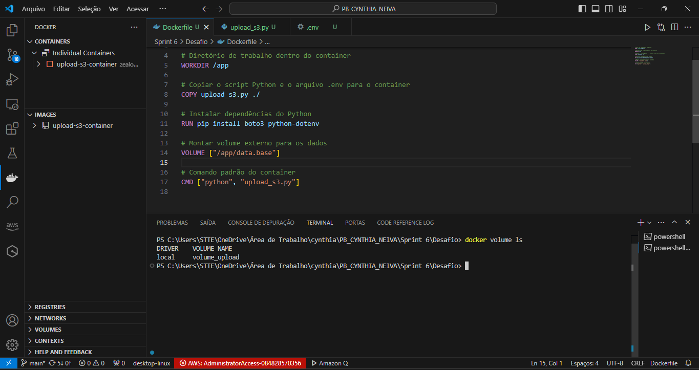

# Objetivo do Desafio Geral e Perguntas para o Dashboard #

O objetivo dessa análise é explorar e entender padrões, tendências e fatores que influenciam a avaliação e a popularidade de filmes de comédia, utilizando os dados fornecidos. A análise busca responder perguntas-chave que podem guiar tomadas de decisão estratégicas na indústria cinematográfica, como identificar características associadas a filmes de sucesso ou explorar discrepâncias nas avaliações.

A análise é baseada em um banco de dados de filmes com informações detalhadas sobre títulos, gêneros, avaliações (nota média e número de votos), duração, artistas envolvidos, seus papéis e características, como profissão e ano de nascimento. Ela se concentra em examinar relações entre essas variáveis para obter insights significativos.

1. Análise de Tendências e Popularidade
* Quais fatores (gênero, duração, ano de lançamento) têm maior correlação com altas notas médias e número de votos?
* Existe um período específico em que um determinado gênero se destacou em termos de avaliação?
* Diretores ou artistas com maior número de títulos conhecidos contribuem para um aumento significativo na nota média ou no número de votos dos filmes?

2. Avaliação Geral dos Filmes
* Há diferenças significativas entre a avaliação de filmes curtos (menos de 90 minutos) e filmes longos (mais de 120 minutos)?

3. Impacto dos Artistas
* Artistas que trabalharam em mais filmes ("títulos mais conhecidos") tendem a estar associados a filmes com maiores notas médias?

# Objetivo do Desafio #

O objetivo do desafio é automatizar o upload de arquivos CSV para um bucket S3 usando um container Docker. Ele testa habilidades em criação e gestão de containers, integração com AWS, organização de dados na nuvem e automação de processos com Python.

## Etapa 01: Script em python para automação  ##

 

  

1. Importação de Bibliotecas
* import os: A biblioteca os fornece funcionalidades para interagir com o sistema operacional, como acessar variáveis de ambiente e manipular caminhos de arquivos.

* import boto3: boto3 é a biblioteca oficial da AWS para Python. Ela é usada para interagir com serviços da AWS, como o S3, permitindo o upload e download de arquivos, entre outras operações.

* from dotenv import load_dotenv: A biblioteca dotenv é usada para carregar variáveis de ambiente a partir de um arquivo .env. Isso ajuda a manter as credenciais e configurações sensíveis fora do código-fonte.

* from datetime import datetime: Importa o módulo datetime que permite trabalhar com datas e horas. Ele será utilizado para organizar os arquivos no S3 com base na data atual.

* load_dotenv(): Este método carrega as variáveis de ambiente definidas no arquivo .env para o ambiente Python. As variáveis podem incluir credenciais e configurações, como chaves de acesso à AWS, informações do bucket e mais.

* LOCAL_DIR: Este é o diretório local onde os arquivos a serem enviados para o S3 estão armazenados. No caso do código, o diretório é /app/data.base. Este caminho deve ser alterado conforme o local onde os arquivos estão armazenados em seu ambiente.

* RAW_ZONE_PATH: Este é o caminho base no S3 onde os arquivos serão armazenados. Ele define uma estrutura de diretórios dentro do bucket, que será usada para organizar os arquivos. A estrutura sugerida é um caminho de dados brutos (raw) seguido da categoria (por exemplo, CSV), e a data do envio será incorporada ao caminho no S3.

 

 

2. A função upload_to_s3 recebe dois parâmetros:
   
* local_file: O caminho completo do arquivo no sistema local que será enviado para o S3.
* s3_path: O caminho onde o arquivo será armazenado no S3, incluindo o nome do arquivo.
boto3.client('s3'): Cria um cliente da AWS S3 usando a biblioteca boto3. Esse cliente é responsável por interagir com o serviço S3 da AWS, permitindo o upload e manipulação de arquivos no S3.

3. Parâmetros de Autenticação:

* aws_access_key_id e aws_secret_access_key: São as credenciais da AWS necessárias para autenticação no serviço S3. Elas são passadas como variáveis de ambiente e acessadas com os.getenv.
* aws_session_token: Token temporário necessário quando se usa credenciais temporárias, por exemplo, quando se usa a autenticação multifatorial (MFA) da AWS.
* region_name: A região AWS onde o bucket S3 está localizado (por exemplo, us-west-2).

4. Tentativa de Upload:

* try: O bloco try tenta realizar o upload do arquivo. Caso algo dê errado durante a execução, ele entra no bloco except.
* s3.upload_file(local_file, BUCKET_NAME, s3_path): Este método faz o upload do arquivo especificado em local_file para o bucket S3 especificado por BUCKET_NAME, usando o caminho s3_path para armazenar o arquivo dentro do bucket.
* local_file: Caminho do arquivo no sistema local.
* BUCKET_NAME: Nome do bucket S3 onde o arquivo será armazenado.
* s3_path: Caminho dentro do bucket S3 onde o arquivo será salvo. Esse caminho pode incluir subpastas e o nome do arquivo.
* print(f"Arquivo enviado: {local_file} -> s3://{BUCKET_NAME}/{s3_path}"): Após o upload bem-sucedido, é impresso no console uma mensagem indicando que o arquivo foi enviado com sucesso para o S3.

5. Tratamento de Erros:

* except Exception as e: Caso ocorra algum erro durante o upload, esse bloco captura a exceção e imprime uma mensagem de erro no console.
* print(f"Erro ao enviar {local_file}: {e}"): A mensagem de erro é impressa, indicando qual arquivo não pôde ser enviado e o motivo do erro (armazenado na variável e).

 

* A função process_and_upload é responsável por processar os arquivos de um diretório local e fazer o upload de arquivos CSV para o Amazon S3.
* os.path.exists(LOCAL_DIR): Verifica se o diretório definido em LOCAL_DIR existe. LOCAL_DIR é o caminho para a pasta local onde os arquivos CSV estão armazenados.
* Se o diretório não existir, imprime uma mensagem de erro e retorna, encerrando a função sem continuar o processo de upload.
* os.walk(LOCAL_DIR): Percorre recursivamente todos os arquivos e subdiretórios dentro de LOCAL_DIR.
* if file.endswith('.csv'): Verifica se o arquivo tem a extensão .csv. Caso tenha, ele será processado para upload para o S3.
* category: Determina se o arquivo pertence à categoria "Movies" ou "Series". Isso é feito verificando se a palavra "movies" está no nome do arquivo, independentemente de maiúsculas ou minúsculas.
* today = datetime.now(): Obtém a data e hora atual.
* s3_path: Cria um caminho dinâmico no S3 para o arquivo. O caminho inclui a categoria (Movies ou Series), o ano, o mês e o dia atuais, seguidos pelo nome do arquivo.
* O formato {today.month:02} e {today.day:02} garante que o mês e o dia sempre apareçam com dois dígitos (ex.: "12" para dezembro e "01" para o primeiro dia do mês).
* os.path.join(root, file): Combina o diretório atual root com o nome do arquivo `file para formar o caminho completo do arquivo local.
* print(f"Iniciando upload de {local_file} para s3://{BUCKET_NAME}/{s3_path}"): Exibe uma mensagem no console informando que o upload do arquivo começou.
* upload_to_s3(local_file, s3_path): Chama a função upload_to_s3, passando o caminho local do arquivo e o caminho do S3 onde o arquivo será armazenado. Essa função é responsável por fazer o upload real do arquivo.
* if __name__ == "__main__":: Garante que o código dentro desse bloco só seja executado quando o script for executado diretamente, e não quando importado como módulo em outro script.
* process_and_upload(): Chama a função process_and_upload que começa o processamento e upload dos arquivos.
* print("Processo concluído!"): Exibe uma mensagem no console quando o processo de upload é concluído.

## Etapa 02: Arquivo .env  ##

 

* O arquivo .env é usado para armazenar variáveis de ambiente de maneira que possam ser facilmente acessadas por seu código, especialmente em projetos que envolvem configurações sensíveis ou de ambiente, como credenciais de acesso e configurações de serviço (no caso, as configurações para o AWS).

* No contexto deste projeto, o arquivo .env serve para fornecer as credenciais e as configurações necessárias para se conectar ao serviço da Amazon Web Services (AWS) e enviar arquivos para um bucket no Amazon S3.

## Etapa 03: Arquivo Dockerfile  ##

 

* FROM python:3.9-slim: Esta linha especifica que a imagem base será a versão 3.9 do Python, mas com uma versão "slim" (menor e otimizada). A partir dessa imagem, o Docker criará a nova imagem.
* WORKDIR /app: Define o diretório de trabalho dentro do contêiner como /app. Todos os comandos seguintes (como COPY e CMD) serão executados dentro desse diretório.
* COPY .env /app/.env: Copia o arquivo .env da máquina local para dentro do contêiner no diretório /app. Este arquivo contém as variáveis de ambiente necessárias para a configuração do AWS (como chaves de acesso e o nome do bucket).
* COPY upload_s3.py ./: Copia o script Python upload_s3.py para o contêiner. Esse script será responsável pelo upload dos arquivos para o S3.
* RUN pip install boto3 python-dotenv: Instala as dependências necessárias para o script Python. Aqui, o script utiliza:
* VOLUME ["/app/data.base"]: Cria um volume no Docker que aponta para o diretório /app/data.base dentro do contêiner. Isso permite que dados possam ser compartilhados entre o contêiner e o sistema local. Esse volume deve ser montado na execução do contêiner para que os dados (como arquivos CSV) possam ser acessados de fora do contêiner.
* CMD ["python", "upload_s3.py"]: Define o comando que será executado por padrão quando o contêiner for iniciado. Neste caso, ele executa o script upload_s3.py com o interpretador Python.

## Etapa 03: Criação do Container  ##

* Ao rodar o Dockerfile, o objetivo é criar uma imagem do Docker que possa ser utilizada para rodar um container contendo todos os componentes necessários para executar o seu script Python, incluindo o upload dos arquivos para o Amazon S3. 

## Etapa 04: Finalização  ##

A finalização da execução do container ocorre após o script Python (upload_s3.py) ser executado dentro do contêiner, realizando o processo de upload dos arquivos para o S3. Como apresentado.

 

 
