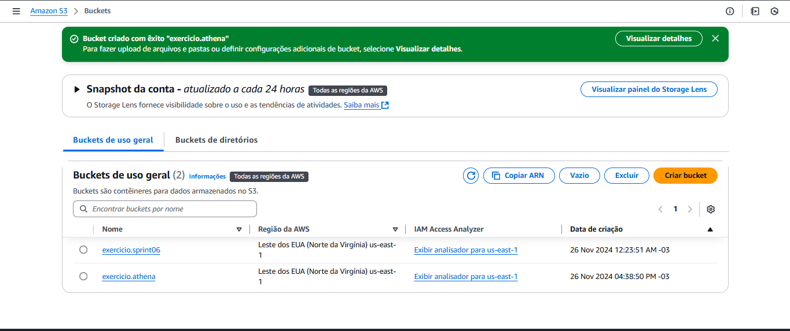
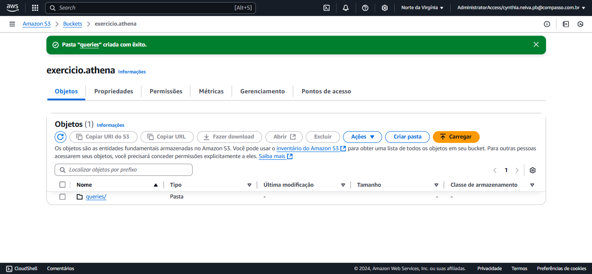
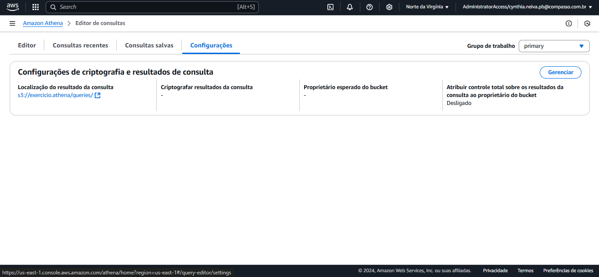
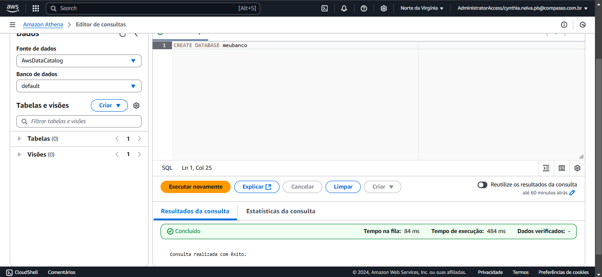
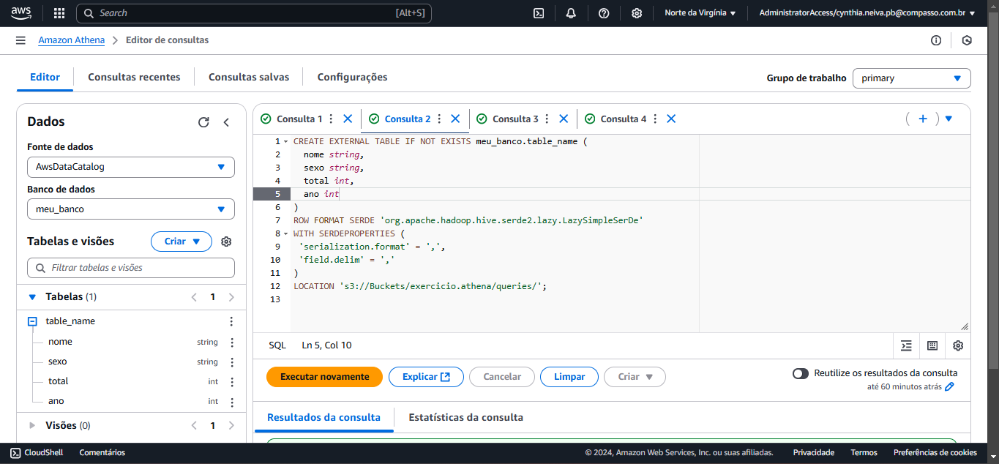

# Exercicio  Lab AWS S3 #

## Etapa 01: Criar um bucket ##

 

## Etapa 02: Habilitar hospedagem de site estático ##

 

 ## Etapa 03: Editar as Configurações do Bloqueio de Acesso Público ##

 

 ## Etapa 04: Tornar Conteúdo do Bucket Público ##

 

  ## Etapa 05: Configurar um Documento de Índice ##

 
 
   ## Etapa 06: Teste endpoint ##

 

 # Exercicio  Lab Athena #

## Etapa 01: Configurar Athena ##

 

 

## Etapa 02: Criar um Banco de Dados ##

## Etapa 03: Criar Tabela ##

