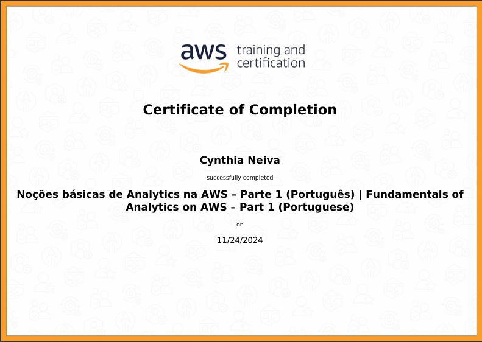

# Objetivo da Sprint

O objetivo da execução do container é automatizar o processo de upload de arquivos locais (como arquivos CSV) para o Amazon S3. Especificamente, a execução do container tem os seguintes objetivos:

* Rodar o script Python: O container executa o script upload_s3.py, que foi copiado para o contêiner durante a construção da imagem. Esse script é responsável por localizar arquivos CSV no diretório local e fazer o upload desses arquivos para o S3, em um formato organizado e categorizado.

* Carregar variáveis de ambiente: O container também carrega as variáveis de ambiente do arquivo .env (que contém credenciais da AWS, como chave de acesso, chave secreta, região e o nome do bucket). Essas variáveis são usadas pelo script Python para autenticar a conexão com o AWS S3.

* Mapear diretórios locais para o container: Ao executar o container, um volume local é montado, permitindo que o container acesse os arquivos presentes em um diretório específico do sistema operacional local (no seu caso, o diretório data.base). Isso permite que o script Python trabalhe com os arquivos locais e os envie para o S3.

* Fazer o upload de arquivos para o S3: O objetivo final é fazer o upload dos arquivos CSV para o bucket S3, criando uma estrutura de pastas organizada, com base em categorias (como "Movies" ou "Series"), e usando a data atual para organizar os arquivos no S3.

# Exercícios

1. [Exercicio](https://github.com/neivis04/PB_CYNTHIA_NEIVA/tree/main/Sprint%206/Exercicios/Exercicio_Lab_AWS_S3)

2. [Exercicio](https://github.com/neivis04/PB_CYNTHIA_NEIVA/tree/main/Sprint%206/Exercicios/Exercicio_Lab_Lambda)

# Certificados

