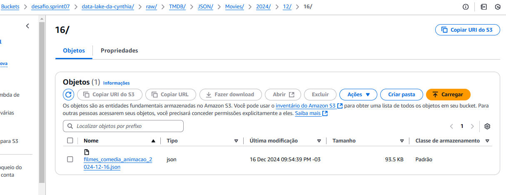

# Objetivo do Desafio #

O desafio visa demonstrar a habilidade de automatizar o processo de coleta, processamento e upload de dados para um Data Lake (S3), utilizando ferramentas e serviços AWS em conjunto, de modo a criar um fluxo eficiente e escalável para o armazenamento e o processamento de dados.

## Etapa 01: Script em python para automação  ##

 

  

1. Carregamento de Variáveis de Ambiente:
* Utiliza a função load_dotenv() para carregar variáveis de ambiente armazenadas em um arquivo .env. Esse arquivo contém dados sensíveis, como chaves de API e credenciais da AWS, e é utilizado para manter a segurança do código.

2. Configuração da API do TMDB:
* A chave de API do TMDB (API_KEY) é carregada a partir das variáveis de ambiente. Ela será usada para autenticar requisições à API.
CAs URLs base para consultar filmes (BASE_URL_MOVIE) e séries de TV (BASE_URL_TV) do TMDB são definidas. Essas URLs são utilizadas para construir as requisições para a API, buscando informações sobre filmes e séries.

3. Configuração da AWS:
* As variáveis relacionadas à configuração da AWS, como as chaves de acesso (AWS_ACCESS_KEY e AWS_SECRET_KEY), o token de sessão (SESSION_TOKEN), a região da AWS (AWS_REGION), e o nome do bucket S3 (BUCKET_NAME), são carregadas a partir das variáveis de ambiente. Essas credenciais permitem que o código se conecte aos serviços da AWS de forma segura.

4. Criação do Cliente S3:
* A função boto3.client() é utilizada para criar um cliente para o serviço S3 da AWS. Esse cliente permite que o código interaja com o Amazon S3, o serviço de armazenamento de objetos da AWS, utilizando as credenciais carregadas anteriormente.
* O cliente S3 será utilizado para realizar operações, como o upload de arquivos, para o bucket especificado.

## Etapa 01: Script em python para automação  ##

 

1. Definição do Diretório Local:
* A variável LOCAL_DIR define o diretório onde os arquivos JSON serão armazenados localmente. O caminho fornecido refere-se a uma pasta específica no computador do usuário.
* A função os.makedirs() cria o diretório especificado, se ele não existir, garantindo que a estrutura de pastas esteja pronta para armazenar os arquivos.
  
2. Caminho da Camada RAW no S3:
* A variável RAW_ZONE_PATH especifica o caminho onde os arquivos JSON serão armazenados dentro do bucket S3. A camada RAW refere-se ao armazenamento bruto de dados, sem processamento adicional.
* O caminho indicado é data-lake-da-cynthia/raw/TMDB/JSON, e os dados serão organizados dentro dessa estrutura de diretórios no S3.
  
3. Parâmetros Base para Busca na API:
* A variável BASE_PARAMS contém os parâmetros padrão para as requisições à API TMDB. Esses parâmetros incluem:
api_key: A chave da API para autenticação.
* language: Define o idioma das respostas da API como português do Brasil (pt-BR).
* include_adult: Configura a API para excluir conteúdo para adultos.
* include_video: Exclui vídeos relacionados.
* with_genres: Filtra filmes e séries que pertencem aos gêneros "Animação" (16) e "Comédia" (35).
* primary_release_date.lte: Define o filtro para filmes e séries com data de lançamento até 31 de dezembro de 2023.
* page: Inicialmente definido como 1, indica que os resultados serão solicitados a partir da primeira página de resultados.
  
4. Função fetch_data para Buscar Dados da API TMDB:
* A função fetch_data() é responsável por buscar os dados da API TMDB. Ela aceita dois parâmetros:
* url: A URL da API (seja de filmes ou séries) que será usada para fazer a requisição.
tipo: Um parâmetro para identificar se os dados estão relacionados a filmes ou séries, que pode ser utilizado para definir a origem dos dados.
* Dentro da função, um loop é iniciado para buscar os dados até que pelo menos 100 registros sejam obtidos. A cada iteração, os parâmetros de requisição são copiados da variável BASE_PARAMS, mas o número da página (page) é incrementado, permitindo a navegação pelas páginas de resultados da API.
* O código não está completo, mas o objetivo principal é fazer múltiplas requisições até que 100 registros de filmes ou séries sejam coletados, conforme indicado no critério do código.

## Etapa 01: Script em python para automação  ##

 

## 
1. Verificação do Status da Requisição (HTTP 200):
* A condição if response.status_code == 200: verifica se a resposta da API foi bem-sucedida, ou seja, se o status code é 200, o que significa que a requisição foi processada corretamente e os dados estão disponíveis.
* Caso o código da resposta seja diferente de 200, o código imprime uma mensagem de erro, indicando que houve um problema na requisição, com o status code da resposta.
  
2. Extração dos Dados da Resposta:
* Quando a resposta é bem-sucedida, o método .json() é chamado no objeto response, que converte o conteúdo da resposta (geralmente em formato JSON) para um dicionário Python.
* A partir desse dicionário, os dados de interesse são extraídos usando .get("results", []). Esse método tenta acessar o campo "results" da resposta JSON, que contém os registros dos filmes ou séries. Se esse campo não existir, será retornada uma lista vazia, evitando erros.
  
3. Adicionar Registros até 100:
* Um laço for é iniciado para iterar sobre os resultados da busca, ou seja, sobre os filmes ou séries recebidos da API.
Dentro do laço, é verificado se a quantidade de registros já coletados (len(records)) é menor que 100. Se for, o registro atual (result) é adicionado à lista records.
* Se já houver 100 registros, o laço é interrompido com o comando break, o que impede a coleta de mais registros, atendendo ao critério de coletar no máximo 100 itens.
  
4. Impressão de Informações de Progresso:
* Após cada página de resultados ser processada, o código imprime uma mensagem indicando o tipo de dados (filmes ou séries), o número da página atual (page), e o total de registros coletados até o momento (len(records)).
  
5. Controle de Páginas:
* O número da página (page) é incrementado, passando para a próxima página de resultados.
* A verificação if page > data.get("total_pages", 1): verifica se o número da página ultrapassou o total de páginas disponíveis na resposta. Caso tenha chegado ao final das páginas, o laço é interrompido com o break.
  
6. Retorno dos Registros Coletados:
* Após o término da coleta de dados, seja por atingir 100 registros ou por ter processado todas as páginas, a função retorna a lista records, que contém os registros de filmes ou séries coletados.

## Etapa 01: Script em python para automação  ##

1. Função save_to_local(data, tipo)
* A função recebe dois parâmetros: data (os dados a serem salvos) e tipo (o tipo de dados, como "filmes" ou "series").
* A data atual é formatada no formato "YYYY-MM-DD" e é utilizada para criar o nome do arquivo, garantindo que o nome seja único por dia.
* O caminho do arquivo é determinado pela variável LOCAL_DIR, que indica o diretório onde o arquivo será salvo.
* O arquivo é aberto no modo de escrita ("w") com a codificação UTF-8, e os dados são salvos no formato JSON, usando json.dump(). A função json.dump() é configurada para garantir que os caracteres especiais sejam corretamente salvos e que o JSON seja bem formatado.
* Após salvar o arquivo, a função imprime uma mensagem confirmando o sucesso da operação e retorna o caminho completo do arquivo.
  
2. Função upload_to_s3(local_file, s3_path)
* A função recebe dois parâmetros: local_file (o caminho do arquivo local) e s3_path (o caminho do arquivo no bucket do S3).
* A função tenta fazer o upload usando o cliente S3 (s3_client.upload_file()), que é configurado anteriormente com as credenciais da AWS.
* Se o upload for bem-sucedido, é impressa uma mensagem indicando o sucesso. Se ocorrer um erro, a exceção é capturada e uma mensagem de erro é exibida.
  
3. Função lambda_handler(event=None, context=None)
* A função começa com uma mensagem indicando que o processo de coleta de dados e upload para o S3 está sendo iniciado.
Coleta de dados de filmes:
* A função fetch_data(BASE_URL_MOVIE, "filmes") é chamada para buscar os dados de filmes da API TMDB. O tipo "filmes" é passado como parâmetro para ajudar a identificar os dados.
* O resultado da coleta de filmes é salvo localmente com a função save_to_local(filmes, "filmes"), e o caminho do arquivo gerado é armazenado em local_filmes.
  
4. Coleta de dados de séries:
* De forma semelhante, a função fetch_data(BASE_URL_TV, "series") coleta os dados de séries da API TMDB.
* Os dados das séries são salvos localmente em um arquivo JSON com a função save_to_local(series, "series"), e o caminho do arquivo gerado é armazenado em local_series.
* Após a coleta e salvamento dos arquivos locais, o próximo passo seria, em uma versão completa do código, fazer o upload desses arquivos para o S3 (isso não está totalmente mostrado no trecho, mas presumivelmente seria realizado após a coleta e salvamento).

## Etapa 01: Script em python para automação  ##

1. Definir o caminho no S3:
* A estrutura do caminho do bucket S3 é definida com base na camada RAW_ZONE_PATH.
* É incluída uma subpasta para filmes e outra para séries, seguindo o formato de diretórios baseados na data atual (ano, mês e dia).
* O nome do arquivo salvo localmente (local_filmes ou local_series) é extraído e incorporado no caminho para o S3. Isso assegura que os arquivos sejam organizados cronologicamente no bucket.

2. Upload dos arquivos para o S3:
* Os arquivos locais contendo os dados de filmes e séries são enviados para os caminhos definidos no bucket S3 utilizando a função upload_to_s3.
* Cada upload é registrado com uma mensagem no terminal que indica o sucesso ou falha no envio.

3. Mensagem de conclusão:
* Após realizar o upload dos dois arquivos, uma mensagem é exibida no terminal para confirmar que o processo foi concluído com sucesso.
Retorno do Lambda (se for usado no ambiente Lambda):
* A função retorna um objeto com statusCode 200, indicando que a execução foi bem-sucedida.
* A mensagem no corpo (body) confirma que os dados foram coletados e armazenados corretamente na camada RAW do S3.

4. Execução como script local:

* Se o código for executado diretamente (fora do ambiente Lambda), a função lambda_handler é chamada automaticamente para realizar todo o processo.
* Isso permite que o mesmo código seja usado tanto no ambiente Lambda quanto em um ambiente de desenvolvimento ou teste local.

## Etapa 01: Processo executado ##

* As mensagens de "Página X processada" indicam que a coleta de dados da API TMDB foi realizada com sucesso.
* "Arquivo salvo localmente" indica que os dados foram salvos no diretório local.
* "Arquivo enviado" mostra o progresso do upload dos arquivos para o bucket S3.
* Por fim, o processo é finalizado com uma mensagem indicando sucesso no processo.

## Etapa 01: Resultado Final ##

Ao executar o código, terá um arquivo JSON contendo até 100 filmes (ou o número máximo retornado pela API, com base na configuração de paginação).
Cada filme terá informações detalhadas, como título, descrição, data de lançamento, avaliação, gêneros, entre outras.
Este arquivo JSON pode ser usado para análises, recomendações, ou pode ser armazenado e enviado para outras plataformas, como um Data Lake ou um Bucket S3, conforme sua necessidade.

O arquivo JSON conterá informações de até 100 séries, dependendo da quantidade disponível e da configuração da API.
Cada série será representada com detalhes como título, sinopse, data de estreia, número de temporadas, avaliações, e outros dados importantes.
Ao executar o código, terá uma lista completa de séries relevantes para a consulta realizada, podendo armazená-las para análises, exibições, ou até mesmo exportá-las para outros sistemas como um Data Lake ou S3.

## Etapa 02: Envio para o Bucket ##

 
 

 
1. Ao enviar os dados para o bucket S3, o processo geralmente envolve a transferência dos arquivos localmente gerados (como os arquivos JSON com informações de filmes e séries) para o serviço de armazenamento da AWS.
