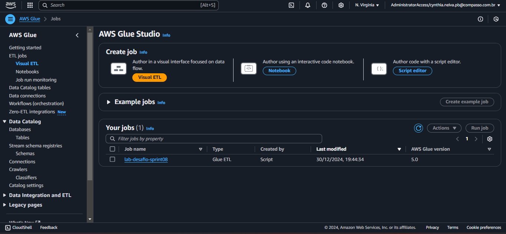

# Objetivo do Desafio #

O objetivo do desafio é realizar o processamento de dados de filmes usando a ferramenta AWS Glue. O fluxo de trabalho consiste em pegar um arquivo JSON de um bucket S3, realizar tratamentos nos dados, como limpeza e formatação, e, em seguida, armazená-los em outro bucket S3 no formato Parquet.

## Etapa 01: Criação Role ##

## Etapa 01: Criação do Job ##

## Etapa 01: Teste Localmente ##

Antes de executar no AWS Glue, fiz tratamento rapidamente no csv da Sprint 07 para tem um caminho o qual seguir, antes de executar no AWS Glue.
* Criei colunas com as suas respectivas categorias e apaguei linhas nulas ou vazias.

## Etapa 02: Script em python para tratamento do CSV  ##

 

 

Este processo é ideal para processamento de grandes volumes de dados em ambientes distribuídos, como o AWS Glue, e permite que os dados sejam limpos, transformados e salvos eficientemente no formato Parquet, que é altamente otimizado para leitura e processamento em big data.

 

1. Inicialização do Contexto do Spark e Glue:
* O código começa importando as bibliotecas necessárias e inicializando o contexto do Spark e do Glue, permitindo que o código leia e processe dados usando o Spark em conjunto com o Glue.
* É configurado também o nome do trabalho usando getResolvedOptions().Esse arquivo contém dados sensíveis, como chaves de API e credenciais da AWS, e é utilizado para manter a segurança do código.

2. Definição dos Caminhos de Entrada e Saída:
* O caminho do arquivo JSON de entrada no S3 é especificado, assim como o caminho de saída para armazenar os dados processados em formato Parquet.
* O nome do arquivo Parquet de saída também é definido.
  
3. Leitura do Arquivo JSON:
* O arquivo JSON é lido a partir do caminho de entrada usando o Spark, convertendo-o em um DataFrame para permitir o processamento dos dados.
  
4. Tratamento de Dados:
* Exclusão de Linhas Nulas: As linhas nulas são removidas usando df.na.drop().
* Filtragem de Registros com 'overview' Vazio: Registros com o campo 'overview' vazio são removidos com df_cleaned.filter(col('overview') != '').
* Conversão de Coluna 'release_date': A coluna 'release_date' é convertida para o tipo date, para garantir que os dados de data sejam manipulados corretamente.

5. Adição de Colunas de Data para Particionamento
* Colunas de ano, mês e dia são adicionadas dinamicamente para facilitar o particionamento dos dados ao salvar no S3.

6. Especificação do Caminho de Saída Parquet
* O caminho para salvar os dados processados em formato Parquet é definido com base nas colunas de data adicionadas.

7. Consolidação dos Dados
* Os dados são consolidados em um único arquivo usando df_cleaned.coalesce(1) para garantir que todos os dados sejam salvos em um único arquivo Parquet.

8. Salvamento no S3
* O DataFrame tratado é salvo como um arquivo Parquet no S3 usando df_single_file.write.mode('overwrite').parquet(output_path_parquet).

9. Renomeação do Arquivo e Limpeza
* Após o arquivo ser salvo, ele é renomeado para o nome final especificado (filmes_comedia_animacao_2024-12-30.parquet).
* A operação usa boto3 para listar os arquivos na pasta temporária, copiar o arquivo para o nome final desejado e excluir o arquivo temporário.

10. Finalização do Trabalho
* Após a conclusão do processamento e salvamento dos dados, o trabalho é finalizado com job.commit().

## Etapa 02: Envio do Parquet para o Bucket  ##

 
  
* O arquivo JSON é lido do S3.
* Dados são limpos (remoção de linhas nulas e com overview vazio).
* A coluna release_date é convertida para o tipo de dado adequado.
* O DataFrame é salvo em um único arquivo Parquet em um diretório organizado por data.
* O arquivo gerado é renomeado para o nome final e os arquivos temporários são excluídos.
* O trabalho do Glue é finalizado.

## Etapa 02: Bucket Sprint 08  ##

 
