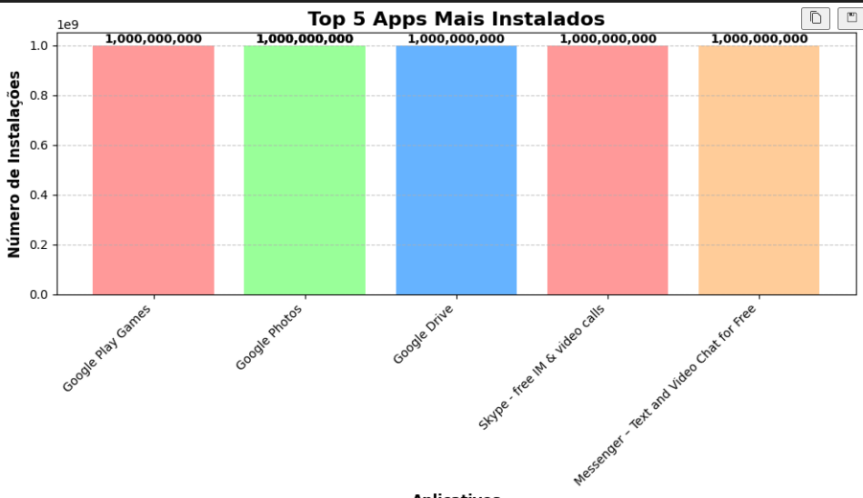
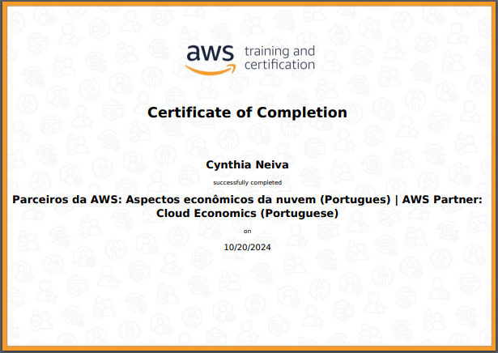

# Exercícios

1. [Exercicio_Python_I_1-2](Exercicios/Exercicio_Python_I_1-2)

2. [Exercicio_Python_I_2-2](Exercicios/Exercicio_Python_I_2-2)

3. [Exercicio_Python_II](Exercicios/Exercicio_Python_II)

# Evidências

Ao executar o código do exercício ... observei que ... conforme podemos ver na imagem a seguir:

# Certificados

- Certificado da AWS disponibilizado na Sprint

