# Objetivos

Esses códigos, juntos, estabelecem um sistema de gerenciamento de informações que pode ser utilizado para várias finalidades comerciais, como análise de performance, desenvolvimento de estratégias de vendas, e otimização de operações de locação de veículos.

# Ativação de Chaves Estrangeiras - Etapa 1
  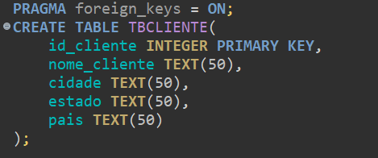
Este comando é usado para garantir que as restrições de integridade referencial (chaves estrangeiras) estejam ativas no banco de dados SQLite. No SQLite, as chaves estrangeiras não são aplicadas por padrão, então é necessário ativá-las.

# Criação das Tabelas - Etapa 1
  
 Esta tabela armazena informações dos clientes. id_cliente é a chave primária (PK) e será um número único para cada cliente.   Outros campos armazenam o nome, cidade, estado, e país de cada cliente, com tipos de dados TEXT.

 
 
 

  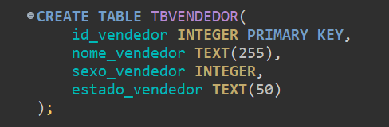
 Esta tabela armazena dados dos vendedores. 
id_vendedor é a chave primária, e outros campos incluem o nome, sexo (provavelmente 0 para masculino e 1 para feminino), e o estado de residência do vendedor.

 
 
 

  
Esta tabela contém informações sobre os carros disponíveis para locação. 
id_carro é a chave primária, e os outros campos armazenam dados como a marca, modelo, classificação, ano de fabricação e quilometragem.

 
 
 

  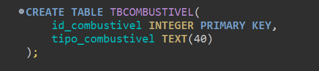
Esta tabela armazena os tipos de combustíveis que os carros utilizam. 
id_combustivel é a chave primária, e tipo_combustivel descreve o tipo de combustível (Gasolina, Etanol, etc.).

 
 
 

  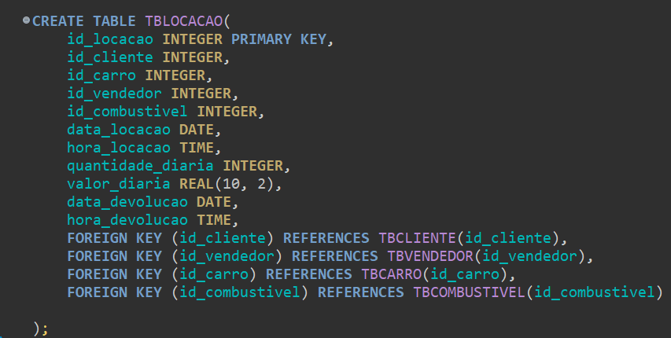
Esta tabela registra as locações de carros. 
id_locacao é a chave primária. 
Existem chaves estrangeiras para clientes, vendedores, carros, e combustíveis, garantindo que as informações dessas tabelas estejam relacionadas corretamente. 
Outros campos incluem a data e hora de locação e devolução, a quantidade de dias, e o valor diário da locação. 

# Uso de Chaves Estrangeiras - Etapa 1
  
As chaves estrangeiras (foreign keys) garantem que os valores inseridos em TBLOCACAO estejam relacionados corretamente com as tabelas TBCLIENTE, TBVENDEDOR, TBCARRO, e TBCOMBUSTIVEL. Isso preserva a integridade referencial.

# Inserção de Dados - Etapa 1

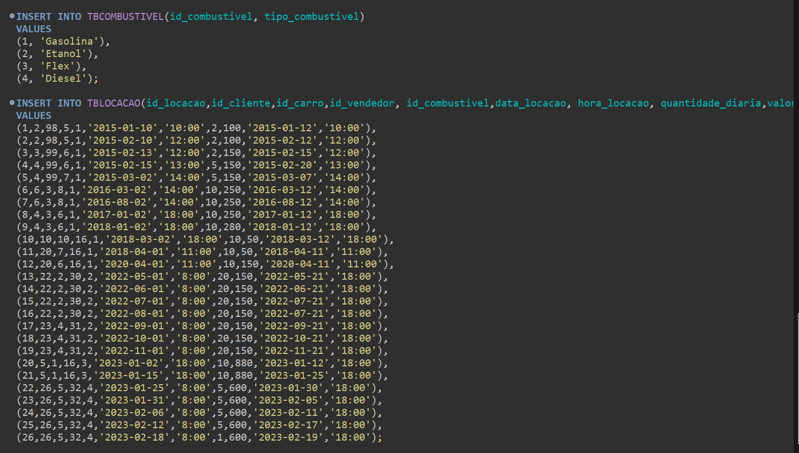
O comando INSERT INTO adiciona registros à tabela TBCOMBUSTIVEL e TBLOCACAO.

# Criação da View: LOCACOES_VENDEDOR - Etapa 2

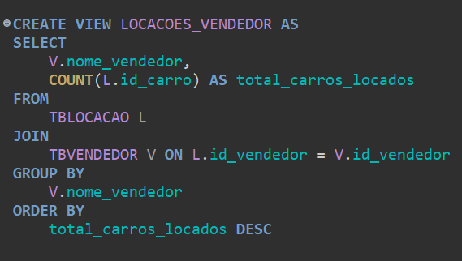
CREATE VIEW LOCACOES_VENDEDOR AS: Cria uma nova view chamada LOCACOES_VENDEDOR.  
SELECT V.nome_vendedor, COUNT(L.id_carro) AS total_carros_locados: Seleciona o nome do vendedor e conta o número total de carros locados por cada vendedor. 
FROM TBLOCACAO L: Utiliza a tabela TBLOCACAO (locações) como a tabela principal. 
JOIN TBVENDEDOR V ON L.id_vendedor = V.id_vendedor: Faz uma junção (JOIN) com a tabela TBVENDEDOR (vendedores) com base no id_vendedor, permitindo que você obtenha informações do vendedor correspondente a cada locação. 
GROUP BY V.nome_vendedor: Agrupa os resultados pelo nome do vendedor, de modo que a contagem de locações seja feita para cada vendedor. 
ORDER BY total_carros_locados DESC: Ordena os resultados pela contagem de carros locados em ordem decrescente, ou seja, os vendedores que locaram mais carros aparecem primeiro.

# Resultado da View: LOCACOES_VENDEDOR 

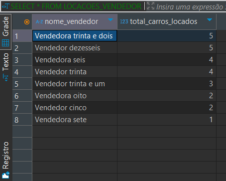

# Criação da View: KM_CLIENTES - Etapa 2

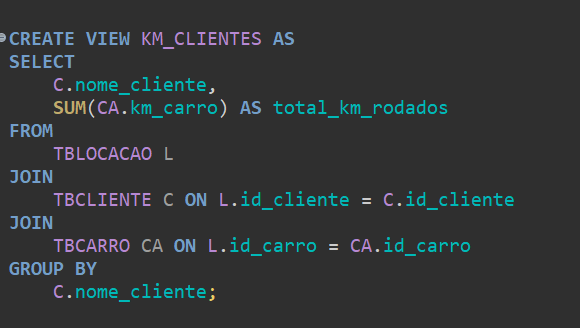
RREATE VIEW KM_CLIENTES AS: Cria uma nova view chamada KM_CLIENTES. 
SELECT C.nome_cliente, SUM(CA.km_carro) AS total_km_rodados: Seleciona o nome do cliente e a soma dos quilômetros rodados dos carros que o cliente alugou. 
FROM TBLOCACAO L: Utiliza a tabela TBLOCACAO como a tabela principal. 
JOIN TBCLIENTE C ON L.id_cliente = C.id_cliente: Faz uma junção com a tabela TBCLIENTE (clientes) para obter o nome de cada cliente com base em seus IDs. 
JOIN TBCARRO CA ON L.id_carro = CA.id_carro: Faz uma junção com a tabela TBCARRO (carros) para obter os detalhes do carro, incluindo a quilometragem. 
GROUP BY C.nome_cliente: Agrupa os resultados pelo nome do cliente, de modo que a soma dos quilômetros rodados seja calculada para cada cliente. 

# Resultado da View: KM_CLIENTES

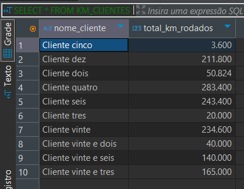

# Criação da View: SEXO_VENDEDOR - Etapa 2

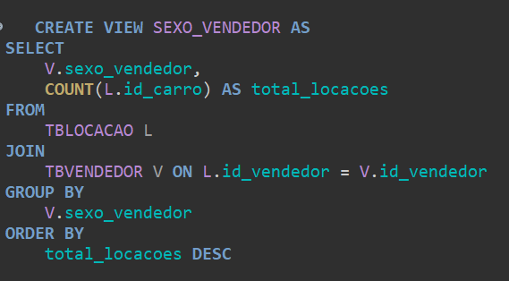
CREATE VIEW SEXO_VENDEDOR AS: Cria uma nova view chamada SEXO_VENDEDOR. 
SELECT V.sexo_vendedor, COUNT(L.id_carro) AS total_locacoes: Seleciona o sexo do vendedor e conta o número total de locações feitas por cada sexo. 
FROM TBLOCACAO L: Utiliza a tabela TBLOCACAO como a tabela principal. 
JOIN TBVENDEDOR V ON L.id_vendedor = V.id_vendedor: Faz uma junção com a tabela TBVENDEDOR para obter o sexo do vendedor correspondente a cada locação. 
GROUP BY V.sexo_vendedor: Agrupa os resultados pelo sexo do vendedor, permitindo contar quantas locações foram feitas por vendedores de cada sexo. 
ORDER BY total_locacoes DESC: Ordena os resultados pela contagem de locações em ordem decrescente. 

# Resultado da View: SEXO_VENDEDOR

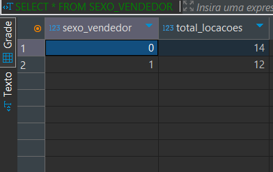

  
